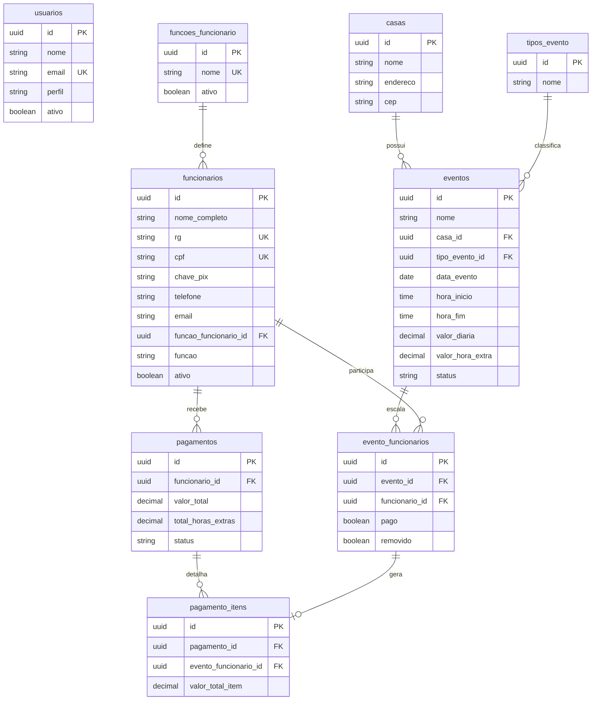

# Modelo de Dados — Sistema TAG

## Entidades principais

- usuarios
- funcionarios
- funcoes_funcionario
- casas
- tipos_evento
- eventos
- evento_funcionarios
- pagamentos
- pagamento_itens

## Diagrama entidade-relacionamento



## Funções de funcionário

A tabela `funcoes_funcionario` centraliza os nomes das funções usadas no cadastro de funcionários. Isso evita que a função seja sempre digitada manualmente no frontend.

A entidade possui:

- `nome`: obrigatório, máximo de 100 caracteres e único.
- `ativo`: permite remover a função das opções sem excluir o registro.
- campos de auditoria básica: `data_criacao`, `data_alteracao`, `usuario_criacao_id` e `usuario_alteracao_id`.

O relacionamento principal é:

```text
funcoes_funcionario.id -> funcionarios.funcao_funcionario_id
```

O campo `funcionarios.funcao` permanece como texto desnormalizado para preservar compatibilidade com dados e relatórios existentes. Nas criações e alterações, a API grava `funcao_funcionario_id` e também sincroniza `funcao` com o nome da função selecionada.

## Pagamento pendente

Um vínculo deve aparecer como pendente quando:

```text
evento.status = Finalizado
evento_funcionario.pago = false
evento_funcionario.removido = false
```

## Scripts e migrations

A tabela de funções pode ser criada via Entity Framework:

```powershell
dotnet ef database update --project .\src\TagSeguranca.Api\TagSeguranca.Api.csproj
```

Também existe o script SQL direto:

```text
database/scripts/20260619_add_funcoes_funcionario.sql
```

O script cria a tabela `funcoes_funcionario`, cria o índice único por `nome`, cria `funcionarios.funcao_funcionario_id`, cria a FK e insere as funções iniciais `Segurança`, `Líder` e `Coordenador` se ainda não existirem.
