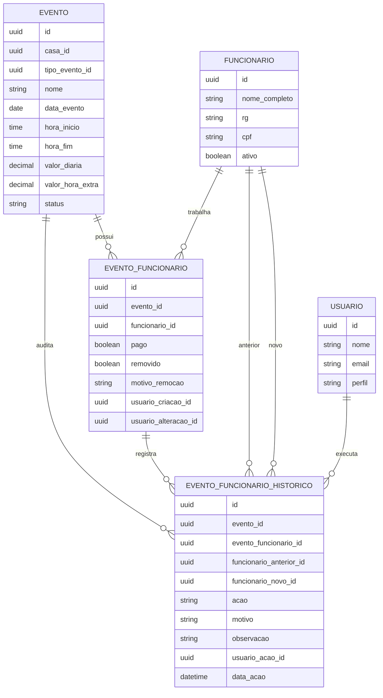
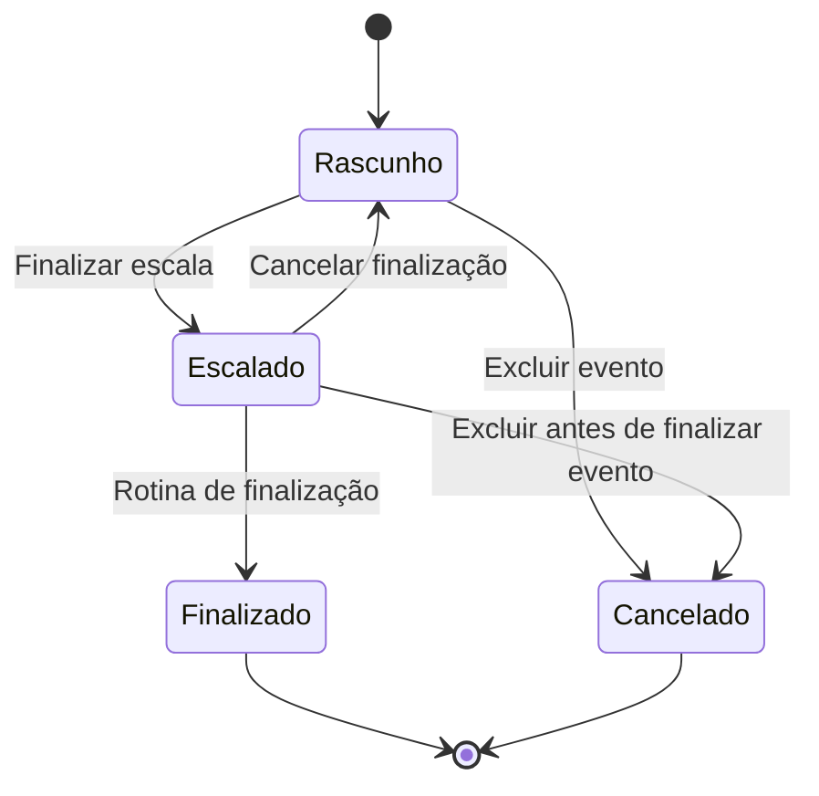

# Ajustes backend — Operação / Escala

Este arquivo registra os ajustes backend feitos durante a etapa de Operação / Escala.

## Ajustes implementados

- Corrigido o seed de funções padrão no `SchemaInitializer` para não depender de `ON CONFLICT (nome)`.
- O seed agora evita duplicidade por `id` ou por nome ativo, compatível com índice parcial por `ativo = true`.
- Removidos defaults redundantes do modelo EF para enums `Evento.Status` e `Pagamento.Status`, pois as entidades já inicializam os valores em código.
- Adicionado filtro operacional em `GET /api/eventos?apenasOperacao=true`, ocultando eventos cancelados e finalizados fora da janela de 24h.
- Ajustado fluxo de escala: adicionar/substituir funcionário não muda mais o status do evento para `Escalado`.
- Criado endpoint `POST /api/eventos/{eventoId}/funcionarios/finalizar` para finalizar explicitamente a escala e marcar o evento como `Escalado`.
- Criado endpoint `POST /api/eventos/{eventoId}/funcionarios/cancelar-finalizacao` para voltar a escala de `Escalado` para `Rascunho`, com bloqueio para evento finalizado/cancelado e vínculo pago.
- Criada tabela `evento_funcionarios_historico` para auditar as ações de escala: adicionar, reativar, remover, substituir, finalizar escala e cancelar finalização.
- Cada histórico registra evento, vínculo quando aplicável, funcionário anterior, funcionário novo, ação, motivo, observação, usuário e data da ação.
- Adicionada migration `20260624120000_AddEventoFuncionarioHistorico` para versionar formalmente a criação da tabela de histórico.
- Bloqueada a edição cadastral de evento com status `Escalado` ou `Finalizado`.
- Ajustada validação de data passada para usar a data operacional do Brasil, evitando conflito com `DateTime.UtcNow.Date` durante a noite.

## Endpoints operacionais

```text
GET    /api/eventos?apenasOperacao=true
POST   /api/eventos
PUT    /api/eventos/{id}
DELETE /api/eventos/{id}
GET    /api/eventos/{id}/escala/excel
GET    /api/eventos/{id}/escala/pdf
GET    /api/eventos/{eventoId}/funcionarios
POST   /api/eventos/{eventoId}/funcionarios
POST   /api/eventos/{eventoId}/funcionarios/finalizar
POST   /api/eventos/{eventoId}/funcionarios/cancelar-finalizacao
DELETE /api/eventos/{eventoId}/funcionarios/{funcionarioId}
POST   /api/eventos/{eventoId}/funcionarios/substituir
```

## Regras backend relevantes

- Evento nasce como `Rascunho`.
- Adicionar funcionário não muda o status do evento.
- O status `Escalado` só é aplicado por finalização explícita da escala.
- Evento `Escalado` não pode ter cadastro alterado. Para editar casa, tipo, nome, data, horário ou valores, é necessário cancelar a finalização da escala.
- Evento `Finalizado` não pode ter cadastro alterado.
- Evento `Cancelado` não pode ser alterado.
- Evento `Finalizado` não pode ser cancelado.
- Evento `Rascunho` permite inclusão direta de funcionário ativo.
- Evento `Escalado` bloqueia inclusão direta; ajustes devem ocorrer por substituição, remoção ou cancelamento da finalização.
- Cancelar finalização é permitido somente para evento `Escalado` sem vínculo pago.
- Remoção em escala `Rascunho` não exige justificativa.
- Remoção em evento `Escalado` ou `Finalizado` exige justificativa.
- Substituição exige funcionário novo ativo, diferente do antigo e sem vínculo ativo no mesmo evento.
- Vínculo pago não pode ser removido ou substituído.

## Modelo lógico da escala



## Fluxo de status



## Motivo da separação entre vínculo e histórico

A tabela `evento_funcionarios` representa o estado atual da escala. Ela responde perguntas como: quem está vinculado, quem foi removido e quem já foi pago.

A tabela `evento_funcionarios_historico` representa a trilha operacional. Ela responde perguntas como: quem adicionou, quem removeu, por qual motivo, quando ocorreu a substituição e qual usuário executou a ação.

Essa separação evita misturar estado atual com auditoria e prepara a base para relatórios futuros.
